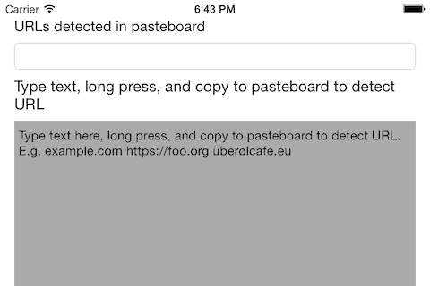

# ORKURLfromPasteBoard

This detects URLs the user has pasted into the clipboard. This can be helpful if you have a field in your app, where the user can enter URLs. Because it can save several steps for the user.

Support for [internationalized domain names (IDNA)](http://en.wikipedia.org/wiki/Internationalized_domain_name).

 is included.

## Usage

To run the example project, clone the repo, and run `pod install` from the Example directory first.

### Classes
#### ORKPasteboardURLChecker
Creates `NSURl`s directly from the general pasteboard `[UIPasteboard generalPasteboard]` or a `UIPasteboard` you provide.

#### ORKLinkDataDetector
Wrapper for `NSDataDetector` for strings that look like links. Put a long string into it and it returns everything substring that looks like a link.

### Categories
#### NSString+ORKurls
Some helper methods for turning strings into URL strings. 

#### NSCharacterSet+ORKurls
Contains valid characters for URLs.

## Requirements

All of it works on iOS. Everything but `ORKPasteboardURLChecker` works also on OS X. Example runs on iOS or iOS simulator. 

## Installation

ORKURLfromPasteBoard is available through [CocoaPods](http://cocoapods.org). To install
it, simply add the following line to your Podfile:

    pod "ORKURLfromPasteBoard"

If you don't want to use CocoaPods, copy the folder `Pod/Classes` into your project. You will also need [Punycode-Cocoa](https://github.com/Wevah/Punycode-Cocoa). Then drag the folder files into the Xcode source tree.

## Author

Jörg Bühmann, joergbuehmann@gmail.com

## License

ORKURLfromPasteBoard is available under the MIT license. See the LICENSE file for more info.

